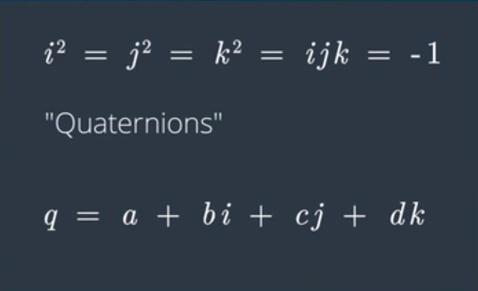
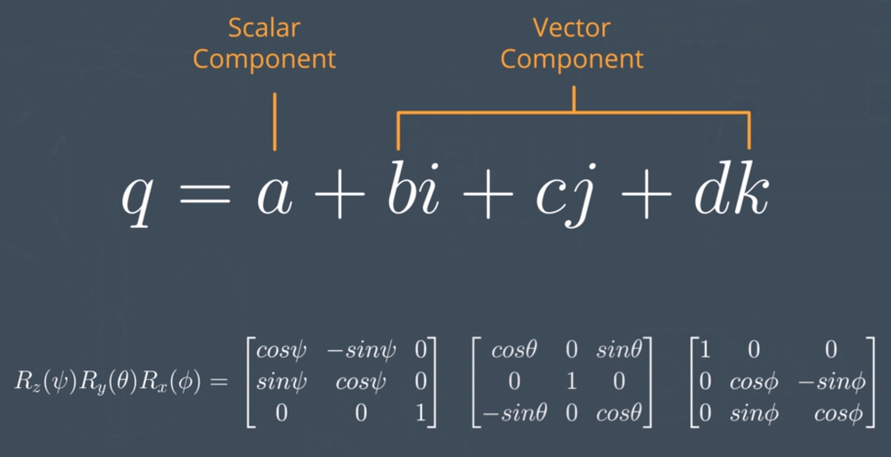
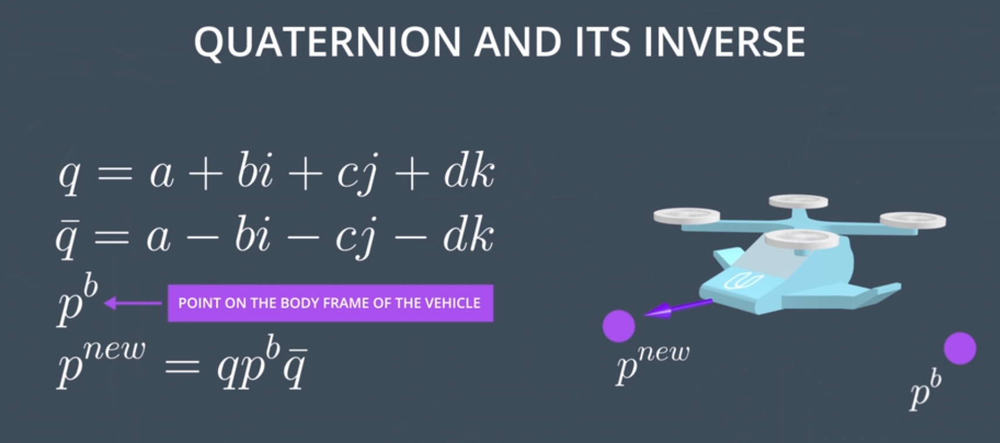
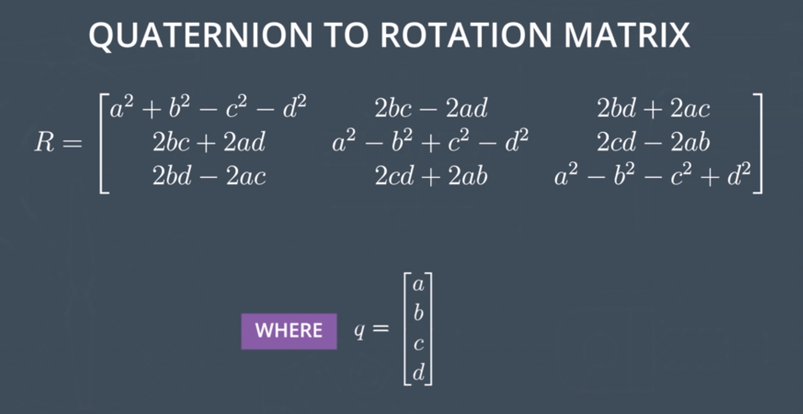
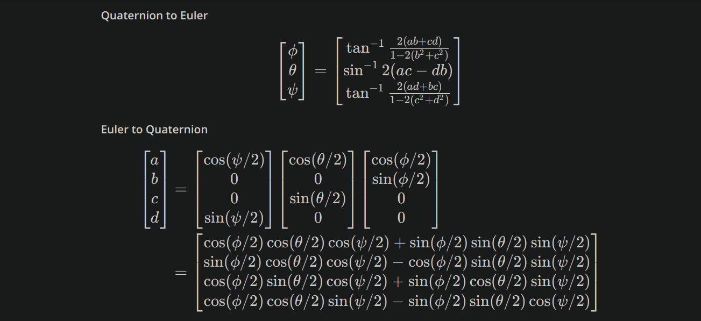
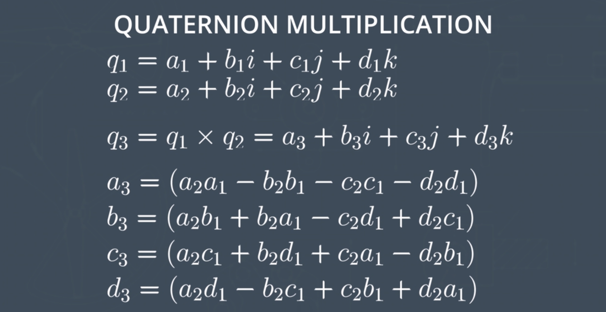

# AAE_Notebook_004_Quaternions
This notebook is a continuation of representing orientation of the vehicle based on its Body Frame.

As seen in the Euler Angle notebook, a vehicles orientation within the Local Frame can be given by the orientation of the Body Frame. Though, unlike with computationally expensive Rotation Matrices, a single [Quaternion](https://en.wikipedia.org/wiki/Quaternion) accomplishes the same thing, mathematically, as a series of rotation matrix multiplication in a more compact form.

Using Quaternions, we can still represent vehicle orientation and changes thereof:

Not only can we convert between Quaternions and Rotation Matrices...

... But, we can also convert Quaternions to Euler Angles

And even multiply Quaternions together:

